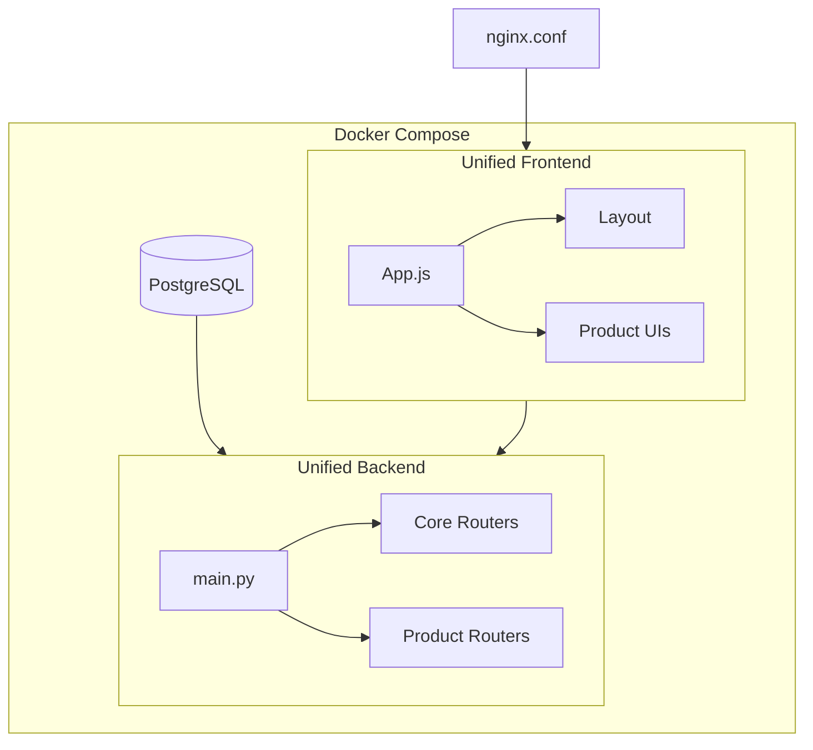

# Ithras Architecture

## Overview

Ithras is an enterprise placement intelligence portal with a modular product architecture. The system uses a unified backend and frontend that serve multiple independent products.

## Modular Structure – Frontend/Backend as Leaves Only

1. **Frontend and backend are always leaf folders** – Nothing can nest inside them. They are leaves.
2. **Both folders exist only when a module has both** – If a module has only frontend or only backend, files go directly in the module (no `frontend/` or `backend/` subfolder).
3. **Submodule hierarchy** – Modules can have submodules; 3–4 levels is fine.
4. **core/app/backend** and **core/app/frontend** – Main app backend (FastAPI) and frontend (shell, layout).

### Shared Layout

Single-purpose modules have files directly; no `frontend/` or `backend/` subfolder:

```
shared/
├── primitives/             # Input.js, Button.js (frontend only)
├── components/             # IthrasLogo.js (frontend only)
├── services/               # apiBase, core, setup (frontend only)
├── database/               # database.py, config.py (backend only)
├── auth/                   # auth.py, jwt_utils, password_utils (backend only)
├── setup/                  # setup engine (backend only)
└── styles/                 # tokens.css, base.css (frontend only)
```

### Core Layout

```
ithras/
└── core/
    ├── app/
    │   ├── backend/        # main.py, FastAPI app, Dockerfile
    │   └── frontend/       # App.js, shell, layout, Dockerfile
    ├── auth/{backend,frontend}/
    ├── setup/{backend,frontend}/
    └── alembic/
```

## High-Level Structure

```
ithras/
├── shared/                 # Shared submodules (primitives, components, services, database, auth, setup, styles)
├── core/                   # Core infrastructure
│   ├── app/
│   │   ├── backend/        # FastAPI app
│   │   └── frontend/       # Shell, layout
│   ├── auth/
│   ├── setup/
│   └── alembic/            # Migrations
├── products/               # Product implementations loaded via registries
│   ├── calendar-management/
│   ├── recruitment-university/
│   ├── recruitment-lateral/
│   ├── profiles/
│   ├── general-feed/
│   └── system-admin/
└── docker-compose.yml      # DB, backend, frontend
```


## Registry is source of truth

Treat these as canonical for product boundaries and wiring:

- `core/app/backend/product_registry.yaml` (if present) defines backend product key -> router module mapping.
- `core/app/frontend/src/productRegistry.js` defines frontend product key -> lazy entry module mapping.

If any older docs mention legacy product names (for example `calendar-scheduling`, `cv-builder`, `placement-governance`) or stale paths, update docs to match these registry files.

| Product key | Backend router module | Frontend entry module |
|---|---|---|
| `calendar-management` | `app.modules.scheduling.routers` | `/products/calendar-management/frontend/src/modules/scheduling/index.js` |
| `cv` | `app.modules.cv_builder.routers` | — |
| `cv-maker` | — | `/products/profiles/cv/frontend/src/modules/cv-maker/index.js` |
| `cv-templates-viewer` | — | `/products/profiles/cv/frontend/src/modules/cv-templates-viewer/index.js` |
| `cv-verification` | — | `/products/profiles/cv/frontend/src/modules/cv-verification/index.js` |
| `recruitment-university` | `app.modules.governance.routers` | `/products/recruitment-university/frontend/src/modules/governance/index.js` |
| `institution-management` | `app.modules.institution.routers` | `/products/profiles/institution/frontend/src/InstitutionAdminPortal.js` |
| `company-management` | `app.modules.company.routers` | `/products/profiles/company/frontend/src/index.js` |
| `candidates` | `app.modules.candidates.routers` | `/products/profiles/candidate/frontend/src/index.js` |
| `general-feed` | `app.modules.feed.routers` | `/products/general-feed/frontend/src/index.js` |
| `recruitment-lateral` | `app.modules.recruitment.routers` | `/products/recruitment-lateral/frontend/src/index.js` |
| `user-management` | `app.modules.user_management.routers` | — |
| `database` | `app.modules.database.routers` | — |
| `migrations` | `app.modules.migrations.routers` | — |
| `testing` | `app.modules.testing.routers` | — |
| `simulator` | `app.modules.simulator.routers` | — |
| `system-admin` | — | `/products/system-admin/core/frontend/src/index.js` |
| `profiles` | — | `/products/profiles/core/frontend/src/index.js` |
| `preparation` | — | `/products/preparation/frontend/src/index.js` |
| `entity-about` | — | `/core/frontend/src/modules/entity-about/index.js` |

## Data Flow



## Core Modules

### Backend

- **shared** (`shared/database/`, `shared/auth/`, `shared/setup/`): Database, config, auth, setup engine
- **core/auth** (`core/auth/backend/`): Auth routers
- **core/setup** (`core/setup/backend/`): data_management, run_setup, setup router
- **core/app** (`core/app/backend/`, `core/app/frontend/`): Main FastAPI app, App shell

### Frontend

- **shared** (`shared/primitives/`, `shared/components/`, `shared/services/`, `shared/styles/`): Primitives, components, API services, styles
- **core/auth** (`core/auth/frontend/`): Login/Register UI
- **core/setup** (`core/setup/frontend/`): Setup screen
- **core/app/frontend** (`core/app/frontend/`): App shell, layout

## Product Structure

Each product has:
- `backend/app/modules/{product}/` - API routers
- `frontend/src/modules/{product}/` - UI components

Products import from shared/core via:
- **Backend**: `sys.path` (workspace root) + `from shared.database import ...`, `from shared.auth import ...`
- **Frontend**: Absolute paths `/shared/primitives/...`, `/shared/services/...`, `/shared/components/...`, `/shared/styles/...`, `/core/...`, `/products/{product}/...`

### System-Admin Product (Modular Structure)

The system-admin product uses a `modules/` layout where each module has its own frontend and backend:

```
products/system-admin/
  modules/
    user_management/   { frontend/, backend/ }
    database/          { frontend/, backend/ }
    migrations/        { frontend/, backend/ }
    testing/           { frontend/, backend/ }
    telemetry/         { frontend/ }  # uses core APIs
    analytics/         { frontend/ }  # uses core APIs
    simulator/         { frontend/, backend/ }
  backend/             # aggregator: app/modules/* re-exports from ../modules/*/backend
  frontend/            # aggregator: src/modules/index.js imports from ../modules/*/frontend
```

The product loader expects routers at `core/app/backend/app/modules/<name>/routers/`; stub files there add `core/app/backend` and `products/system-admin` to `sys.path` and re-export from `modules.<name>.backend.routers`.

## How to Add a New Product

1. Create backend router modules under the target product package and expose a router module path.
2. Create the frontend entry module under the target product package.
3. Register backend key/module in `core/backend/app/product_registry.yaml`.
4. Register frontend key/import in `core/frontend/src/productRegistry.js`.
5. Wire UI navigation/routes in `core/frontend/src/App.js` as needed.

## Cursor Usage

### Context Scoping

Create `ithras/.cursorignore` to exclude products you are not working on. Example:

```
# Uncomment products to exclude from context
# products/calendar-management/
# products/recruitment-university/
products/recruitment-lateral/
products/profiles/
products/general-feed/
products/system-admin/
```

### Product Rules

Each product has a `.cursor/rules/product.mdc` (or `RULE.md`) with:
- Entry points (routers, UI components)
- Core dependencies used
- DB tables

### Module Boundaries

- **core/shared**: Single source for models, schemas. Products depend on it; core does not depend on products.
- **products**: Independent; no product-to-product imports.
- **main.py / App.js**: Orchestration only; keep minimal.
