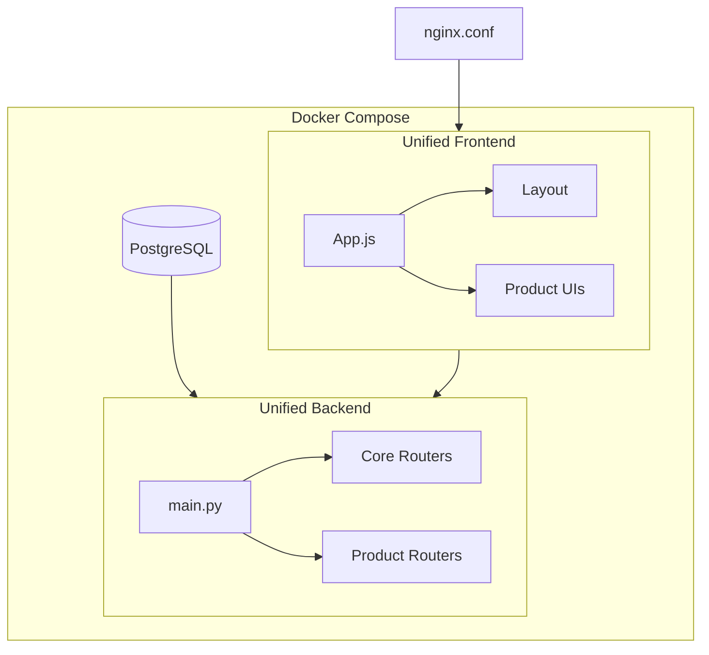

# Ithras Architecture

## Overview

Ithras is an enterprise placement intelligence portal with a modular product architecture. The system uses a unified backend and frontend that serve multiple independent products.

## High-Level Structure

```
ithras/
├── core/                    # Shared infrastructure
│   ├── backend/             # FastAPI app, shared models, schemas
│   └── frontend/            # Shell, layout, shared UI, API services
├── products/                # Six independent products
│   ├── calendar-scheduling/
│   ├── cv-builder/
│   ├── placement-governance/
│   ├── institution-management/
│   ├── company-management/
│   └── system-admin/
└── docker-compose.yml       # DB, backend, frontend
```

## Data Flow



## Core Modules

### Backend (`core/backend/app/modules/`)

| Module | Purpose |
|--------|---------|
| shared | Models, schemas, database, cycles, notifications |
| auth | Authentication |
| tutorials | Tutorials API |

### Frontend (`core/frontend/src/modules/`)

| Module | Purpose |
|--------|---------|
| shared | Layout, types, API service, DnD utilities |
| auth | Login UI |
| tutorials | Tutorials UI |

## Product Structure

Each product has:
- `backend/app/modules/{product}/` - API routers
- `frontend/src/modules/{product}/` - UI components

Products import from core via:
- **Backend**: `sys.path` + `from app.modules.shared import models, database, schemas`
- **Frontend**: Absolute paths `/core/frontend/...`, `/products/{product}/...`

### System-Admin Product (Modular Structure)

The system-admin product uses a `modules/` layout where each module has its own frontend and backend:

```
products/system-admin/
  modules/
    user_management/   { frontend/, backend/ }
    database/          { frontend/, backend/ }
    migrations/        { frontend/, backend/ }
    testing/           { frontend/, backend/ }
    telemetry/         { frontend/ }  # uses core APIs
    analytics/         { frontend/ }  # uses core APIs
    simulator/         { frontend/, backend/ }
  backend/             # aggregator: app/modules/* re-exports from ../modules/*/backend
  frontend/            # aggregator: src/modules/index.js imports from ../modules/*/frontend
```

The product loader expects routers at `backend/app/modules/<name>/routers/`; stub files there add `core/backend` and `products/system-admin` to `sys.path` and re-export from `modules.<name>.backend.routers`.

## How to Add a New Product

1. Create `products/{product-name}/backend/app/modules/` with routers
2. Create `products/{product-name}/frontend/src/modules/` with UI
3. Register in `core/backend/app/main.py` (or `product_registry.yaml`)
4. Add routing in `core/frontend/src/App.js`
5. Add nginx locations if needed (usually `/products/` covers all)

## Cursor Usage

### Context Scoping

Create `ithras/.cursorignore` to exclude products you are not working on. Example:

```
# Uncomment products to exclude from context
# products/calendar-scheduling/
# products/cv-builder/
products/placement-governance/
products/institution-management/
products/company-management/
products/system-admin/
```

### Product Rules

Each product has a `.cursor/rules/product.mdc` (or `RULE.md`) with:
- Entry points (routers, UI components)
- Core dependencies used
- DB tables

### Module Boundaries

- **core/shared**: Single source for models, schemas. Products depend on it; core does not depend on products.
- **products**: Independent; no product-to-product imports.
- **main.py / App.js**: Orchestration only; keep minimal.
