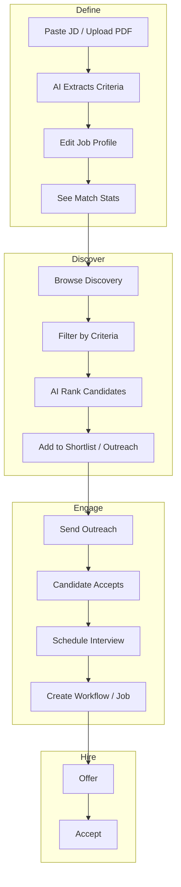

# HR Mode: End-to-End AI-Driven Recruitment (Lateral & Campus)

## Executive Summary

**HR Mode** turns professionals (recruiters) into power users with a complete AI-driven recruitment flow: **discover → qualify → shortlist → schedule → offer**. The goal is to outperform LinkedIn and Naukri by combining:

1. **Verified profiles** (institutional + Digital CV) — no fake resumes
2. **Criteria-first discovery** — define what you need, see who matches *before* applications
3. **AI-native workflow** — from JD to ranked shortlist to outreach
4. **End-to-end on platform** — no context switching
5. **Trust signals** — engagement, network, institutional verification

---

## Current State vs. Target

| Capability | Current | Target (HR Mode) |
|------------|---------|------------------|
| Candidate discovery | Only applicants (post-apply) | Search/filter ALL candidates + professionals |
| Job criteria → stats | None | "X people meet your criteria" before publish |
| AI shortlist | Works on applications only | Works on discovered pool (pre-apply) |
| JD parsing | Manual structured fields | AI-extracts criteria from JD text |
| Outreach / InMail | None | In-platform messaging / connection request |
| Scheduling | Manual via workflow | One-click from shortlist |
| End-to-end flow | Fragmented | Single HR Mode dashboard |

---

## Personas

| Role | Access | Primary Use |
|------|--------|-------------|
| **RECRUITER** (company) | Full HR Mode | Discover, shortlist, schedule, offer |
| **PROFESSIONAL** (alumni) | Limited | Can be discovered; view recruiter outreach |
| **CANDIDATE** (student) | Limited | Can be discovered; apply to jobs |
| **SYSTEM_ADMIN** | Full | Oversight, analytics |

---

## Data Model Additions

### 1. Job Profile / Criteria (new concept)

A **Job Profile** is a recruiter-defined "what we're looking for" — can exist before a formal workflow/job.

**New table: `job_profiles`**

| Column | Type | Description |
|--------|------|-------------|
| id | String (PK) | jp_{uuid} |
| company_id | String (FK) | Company posting |
| created_by | String (FK users) | Recruiter |
| title | String | e.g. "Senior Analyst – Consulting" |
| jd_text | Text | Raw JD (paste from doc/PDF) |
| sector | String | Consulting, Tech, Finance, etc. |
| min_cgpa | Float | Optional |
| max_backlogs | Int | Optional |
| skills_keywords | JSON | ["Python", "SQL", "consulting"] |
| experience_years_min | Int | For lateral (0 = campus) |
| institution_ids | JSON | Target institutes (null = all) |
| program_ids | JSON | Target programs (null = all) |
| status | String | DRAFT, PUBLISHED, CLOSED |
| created_at | DateTime | |
| updated_at | DateTime | |

**Rationale:** Separates "criteria/search config" from formal placement `JobPosting`. Enables stats ("how many match") without creating a job.

### 2. Candidate Discovery Index (optional, phase 2)

For fast semantic search, consider:
- **Embeddings table**: `candidate_embeddings` (candidate_id, embedding vector, cv_summary_hash)
- **JD embedding**: Store embedding for `job_profiles.jd_text` for vector similarity

*Phase 1 can use structured filters + LLM re-ranking without vectors.*

### 3. Outreach / Connection Request (extends network)

**New table: `recruiter_outreach`**

| Column | Type | Description |
|--------|------|-------------|
| id | String (PK) | ro_{uuid} |
| recruiter_id | String (FK) | Who is reaching out |
| candidate_id | String (FK) | Target |
| job_profile_id | String (FK) | Optional – which profile prompted this |
| message | Text | Optional InMail-style message |
| status | String | PENDING, VIEWED, ACCEPTED, DECLINED |
| created_at | DateTime | |

- Candidate gets notification; can accept (share contact) or decline
- Accepting = recruiter can schedule interview; candidate sees job details

---

## API Design

### 1. Job Profile CRUD

| Method | Endpoint | Description |
|--------|----------|-------------|
| POST | /v1/hr/job-profiles | Create job profile |
| GET | /v1/hr/job-profiles | List my company's profiles |
| GET | /v1/hr/job-profiles/:id | Get one |
| PUT | /v1/hr/job-profiles/:id | Update |
| POST | /v1/hr/job-profiles/:id/publish | Publish (status → PUBLISHED) |

### 2. Candidate Discovery

| Method | Endpoint | Description |
|--------|----------|-------------|
| GET | /v1/hr/discovery/candidates | Search/filter candidates |
| POST | /v1/hr/discovery/match-stats | For a job profile: count how many match |
| POST | /v1/hr/discovery/ai-rank | AI rank candidates for a job profile (from discovery pool, not just applicants) |

**Query params for `GET /discovery/candidates`:**
- `job_profile_id` – apply profile criteria as filter
- `institution_id`, `program_id`, `sector`
- `min_cgpa`, `max_backlogs`
- `role` – CANDIDATE, PROFESSIONAL
- `q` – free-text search (name, email, roll_number, CV text)
- `limit`, `offset`

### 3. Match Stats

| Method | Endpoint | Description |
|--------|----------|-------------|
| POST | /v1/hr/discovery/match-stats | Body: `{ job_profile_id }` or inline criteria. Returns: `{ total_matching, by_institution, by_sector }` |

### 4. Outreach

| Method | Endpoint | Description |
|--------|----------|-------------|
| POST | /v1/hr/outreach | Send connection/InMail request |
| GET | /v1/hr/outreach | List sent/received outreach |
| PUT | /v1/hr/outreach/:id/respond | Candidate: ACCEPT / DECLINE |

### 5. AI Rank (extended)

Extend existing `POST /v1/recruitment/ai-shortlist` or add:

- `POST /v1/hr/ai-rank`  
  - Input: `job_profile_id`, `candidate_ids` (from discovery) OR `workflow_id`+`job_id` (legacy)
  - Output: Ranked list with score + reasoning
  - Works on **any** candidate set, not just applicants

---

## Frontend: HR Mode Shell

### Nav Structure (recruiter)

```
HR Mode (new top-level)
├── Discovery          ← NEW: criteria, match stats, browse candidates
├── Job Profiles       ← NEW: create/edit, publish, see stats
├── AI Shortlist       ← Existing, enhanced to use discovery
├── Workflows          ← Existing (placement cycles)
├── Applications       ← Existing
├── Schedule           ← Could be unified view
└── Analytics          ← NEW: funnel, conversion, source
```

### 1. Job Profile Builder

- **Step 1:** Paste JD text (or upload PDF) → AI extracts: title, sector, skills, min_exp, min_cgpa
- **Step 2:** Edit structured criteria (sector, CGPA, skills, institutions)
- **Step 3:** See live **Match Stats** – "127 candidates match" with breakdown (by institution, sector)
- **Step 4:** Publish → visible to discovery; can create workflow/job from profile

### 2. Discovery Page

- **Filters:** Job profile (pre-filled) or manual: institution, program, sector, CGPA, role
- **Stats banner:** "X people match your criteria"
- **Results:** Card grid (avatar, name, headline, key stats, match score if AI-ranked)
- **Actions:** View full profile, Add to shortlist, Send outreach

### 3. Match Stats Component

- Used in Job Profile Builder and Discovery
- Shows: total count, breakdown by institution, breakdown by sector
- Optional: "Top 5 institutes" chart

### 4. AI Shortlist (enhanced)

- **Source:** 
  - Legacy: from workflow applications (unchanged)
  - New: from discovery pool (select candidates, then "AI Rank")
- **Input:** Job profile or workflow+job + candidate list
- **Output:** Ranked list with reasoning; one-click "Add to shortlist" or "Send outreach"

### 5. Outreach Inbox (candidate side)

- New view: "Recruiter Messages"
- List of outreach requests with job summary, company, message
- Actions: View Job Profile, Accept, Decline
- Accept → recruiter gets notified; can schedule

---

## AI Enhancements

### 1. JD → Criteria Extraction

- **Input:** Raw JD text (or PDF)
- **Output:** Structured `{ title, sector, skills[], min_exp, min_cgpa, education_preferred }`
- **Tech:** Gemini (existing) – prompt to extract JSON
- **Use:** Pre-fill Job Profile form

### 2. Candidate Summary for Matching

- Improve `_build_candidate_summary` in ai_shortlist:
  - Include: skills, work experience, education, sector preferences from CV.data
  - Normalize template-specific keys (e.g. `work_experience` vs `experience`)
- **Phase 2:** Use embeddings for semantic match

### 3. AI Rank Prompt Upgrade

- Include full JD text (or job profile criteria) in prompt
- Return `match_score` (0–1) + `reasoning` + `top_matching_aspects`
- Support ranking 50–200 candidates (batch if needed)

---

## End-to-End Flow (HR Mode)



---

## Competitive Positioning

| Feature | LinkedIn | Naukri | Athena HR Mode |
|---------|----------|--------|----------------|
| Verified profiles | Partial | Limited | Institutional + CV verified |
| Discovery by criteria | Recruiter search (paid) | DB search (paid) | Criteria-first, stats before apply |
| AI shortlist | None | None | Native |
| JD → criteria | Manual | Manual | AI-extracted |
| End-to-end on platform | No (external ATS) | No | Yes |
| Trust score | None | None | Engagement + verification |
| Pricing | Premium | Per-resume | Platform-native (TBD) |

---

## Implementation Phases

### Phase 1: Foundations (4–6 weeks)

1. **Job Profiles**
   - Migration: `job_profiles` table
   - CRUD API: `/v1/hr/job-profiles`
   - Frontend: Job Profile Builder (paste JD, edit criteria)

2. **Match Stats**
   - API: `POST /v1/hr/discovery/match-stats`
   - Logic: Filter users (CANDIDATE, PROFESSIONAL) by job profile criteria
   - Frontend: Stats component in Job Profile Builder

3. **Discovery API**
   - `GET /v1/hr/discovery/candidates` – filter by job_profile_id or inline criteria
   - Reuse/extend `get_users` filters; add CV text search if feasible

4. **HR Mode shell**
   - New nav section "HR Mode" for recruiters
   - Discovery page, Job Profiles page

### Phase 2: AI & Ranking (3–4 weeks)

1. **JD Extraction**
   - AI service: JD text → structured criteria
   - Integrate into Job Profile Builder

2. **AI Rank from Discovery**
   - Extend `ai-shortlist` or new `POST /v1/hr/ai-rank`
   - Accept candidate_ids from discovery + job_profile_id
   - Frontend: "AI Rank" button on discovery results

3. **Enhanced candidate summary**
   - Richer CV.data extraction for LLM prompt

### Phase 3: Outreach & Inbox (3–4 weeks)

1. **Recruiter outreach**
   - Table: `recruiter_outreach`
   - API: send, list, respond
   - Notification on new outreach

2. **Candidate inbox**
   - "Recruiter Messages" view
   - Accept/Decline flow
   - Link to job profile

3. **Schedule from outreach**
   - After accept, recruiter can schedule interview (reuse ScheduleInterviewModal)

### Phase 4: Analytics & Polish (2–3 weeks)

1. **Funnel analytics**
   - Profile views → outreach sent → accepted → scheduled → offered
   - By job profile, by source (discovery vs apply)

2. **Create workflow from profile**
   - One-click: Job Profile → Workflow + Job

3. **UX polish**
   - Bulk actions, export, templates

---

## Route & Permission Changes

- **New product/area:** `hr-mode` or extend `recruitment-lateral` with HR Mode views
- **Views:** `hr-discovery`, `hr-job-profiles`, `hr-outreach` (existing ai-shortlist, workflows remain)
- **Roles:** RECRUITER, PLACEMENT_TEAM, PLACEMENT_ADMIN, SYSTEM_ADMIN
- **Permissions:** `hr.discovery`, `hr.job_profiles`, `hr.outreach` (optional RBAC)

---

## Technical Notes

- **CV text search:** If `data` is JSON, consider `jsonb` + GIN index for skills/sector search (PostgreSQL). Phase 1 can use ILIKE on stringified CV or simple key filters.
- **Match stats performance:** Cache for 5–10 min per job_profile_id; invalidate on profile update.
- **Lateral vs campus:** `role=PROFESSIONAL` + `experience_years_min` in job profile; filter users by work_experience in CV.data.
- **Institution scoping:** Recruiter's company may have `institution_ids` from contracts; filter discovery accordingly.

---

## Success Metrics

- **Adoption:** % of recruiters using Discovery + Job Profiles weekly
- **Efficiency:** Time from JD to first shortlist (target: &lt; 30 min)
- **Quality:** Offer acceptance rate, interview show rate
- **Competitive:** "Replaced LinkedIn/Naukri search for lateral" feedback
